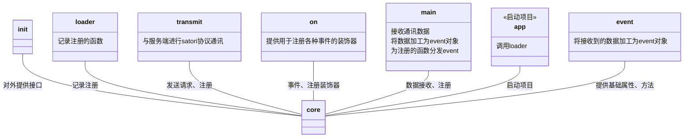

<h1 align="center"> TomorinBOT  </h1>


<div align="center">  </div>
<div align="center">v0.2.0</div>
<div align="center">  人間になりたいうた...
</div>


<h1 align="center">
  <a href="https://github.com/kumoSleeping/TomorinBot/wiki"> Click Here.> Core WIKI</a>
</h1>

***
## イントロダクション


Tomorin项目模版是由Python编写的，代码简单、看似轻小、无异步、线程化、使用注册+依赖模块思想，基于**Satori协议**的的聊天机器人后端**模版框**。     
因此，本程序也是一个satori协议的客户端实现，用于连接satori服务器，接收和发送消息。

整体设计灵感来自Koishi，命名来自[MyGO!!!!!](https://zh.moegirl.org.cn/MyGO!!!!!)。

## 安装 core 所需依赖

```shell
pip install PyYAML requests hupper websocket-client
```

## 使用

```shell
python3 core/app.py
```

### 核心





## 关于此模版
本模版出发点是学习与探索设计方法，让简单的功能实现可以高速产出。 


如果您习惯使用SDK编写项目，推荐您使用[RF-Tar-Railt/satori-python](https://github.com/RF-Tar-Railt/satori-python/releases/tag/v0.4.0)进行开发。

## 仓库
`.gitignore`规则了忽略了所有的`config.yml`。


------


