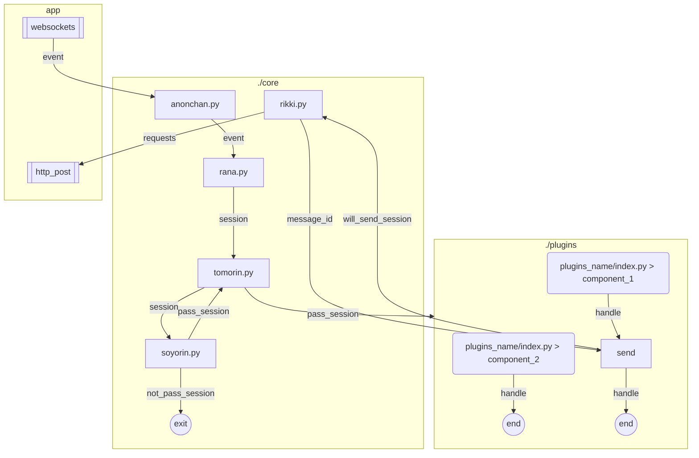

<h1 align="center"> TomorinBOT  </h1>

  

v0.2.0

  人間になりたいうた...

<h1 align="center">
  <a href="https://github.com/kumoSleeping/TomorinBot/wiki"> Click Here.> TomorinBOT Wiki (old ver.)</a>
</h1>

***
## イントロダクション

Tomorin项目模版是由Python编写的，代码简约、无异步、轻量的，基于**Satori协议**的的聊天机器人后端**模版框**。   

整体设计灵感来自Koishi，命名来自[MyGO!!!!!](https://zh.moegirl.org.cn/MyGO!!!!!)。

<!-- ## フロントエンドサポート

| 前端                  | 可用性 |
|:----------------------|:-------:|
| [koishi-plugin-server]()  | ✅     |
| [go-satori-server]()        | 🫓     |
| [satori.js]()              | 🫓     |
| chronocat             | 🏃     |
| lagrange-satori        | 🏃     |

可以用支持Satori协议的服务连接本项目。 -->

<!-- | 功能                  | 说明 |
|:----------------------|:-------:|
| [ws多例连接](https://github.com/kumoSleeping/TomorinBot/wiki/1.%E4%BD%BF%E7%94%A8)  |      |
| [ws自动重连](https://github.com/kumoSleeping/TomorinBot/wiki/1.%E4%BD%BF%E7%94%A8)  |      |
| [webhook基础连接](https://github.com/kumoSleeping/TomorinBot/wiki/1.%E4%BD%BF%E7%94%A8)   | 利用flask的debug启用dev    |
| [混合连接模式](https://github.com/kumoSleeping/TomorinBot/wiki/1.%E4%BD%BF%E7%94%A8)   | 用于无公网启用dev     |
| [插件包系统](https://github.com/kumoSleeping/TomorinBot/wiki/2.%E5%AE%9E%E7%8E%B0%E5%8A%9F%E8%83%BD)             |      |
| [插件包内组件系统](https://github.com/kumoSleeping/TomorinBot/wiki/2.%E5%AE%9E%E7%8E%B0%E5%8A%9F%E8%83%BD)      |      |
| [help系统]()      |      |
| [黑白名单 组件管理]()      |      |
| [h函数快捷包装元素](https://github.com/kumoSleeping/TomorinBot/wiki/%E6%B6%88%E6%81%AF%E5%85%83%E7%B4%A0)     |     |
| [session抽象](https://github.com/kumoSleeping/TomorinBot/wiki/Session)     |     |
| [bot抽象](https://github.com/kumoSleeping/TomorinBot/wiki/Bot)     |     |
| [send与call_api]()     |     | -->

## 各文件说明

### 核心

| core 文件夹              | Purpose | Relationship |
|--------------------|---------|--------------|
| templates 文件夹         |    WebUI     |              |
| api             |    与satori交互的api函数     |              |
| api_request     |     根据api发送requests请求    |              |
| event_decorator |     函数被<事件装饰器>装饰，收到事件会被调用    |              |
| load_plugins    |    加载插件(启动时)     |              |
| server          |     启动TomorinBOT路由    |              |
| server_websocket|    连接ws的实现     |              |
| session         |    在收到event后开始了一天的session     |              |
| session_filter  |    soyorin御用session过滤器     |              |
| session_maker   |   创建session类(来自被动event)       |    继承自api的api         |
| session_utils   |   输出点日志什么(以后会删)      |              |
| wrap_xml        |    提供h函数，快速转化成xml消息元素(str)     |              |
| config          |    读取基准配置，供调用     |              |

### 桥

| bridge 文件夹         | Purpose | Relationship |
|--------------------|---------|--------------|
| tomorin         |    插件从这里导入所需轮子函数     |    此文件夹的对外模块          |
| api_maker       |    提供api_maker创建新api实例     |    继承自core.api          |
| config          |    可以补充config     |    导入了core.config          |
| decorator_maker |    提供了on_activator与on_event装饰器     |    继承自core.event_decorator          |
| session_adder   |    补充session     |    继承自core.session_maker          |
| utils           |    拿破轮     |              |
| wrap_xml_adder  |    可以补充h函数     |    继承自core.wrap_xml          |

### 插件

| plugins 文件夹           | Purpose | Relationship |
|--------------------|---------|--------------|
| help               |    整体的help插件     |       独立实现       |
| soyorin            |    黑白名单总揽管理     |      core.session_filter        |
| ...            |         |              |

## 关于此模版
本模版出发点是学习优秀设计方法，简洁易用。使用此项目的人可以任意修改`./core`中的代码来迎合自己的习惯。   

本项目尽可能的使用简洁美观的方法开发，让简单的功能实现可以高速产出。 

如果您习惯使用SDK编写项目，我十分推荐您使用[RF-Tar-Railt/satori-python](https://github.com/RF-Tar-Railt/satori-python/releases/tag/v0.4.0)进行更高级的开发。

## 仓库
由于本人直接在仓库开发BOT   
`.gitignore`规则了忽略了所有`_开头的文件/文件夹`和`config.yml`。

本仓库不存放生产环境插件，但会存放样板插件案例   

------

# 下方已经无更多内容。

<!-- 

## 機能実現    

以下的链接会跳转到[本项目的Wiki](https://github.com/kumoSleeping/TomorinBot/wiki)。

### 実行プロセス （old）

 -->
