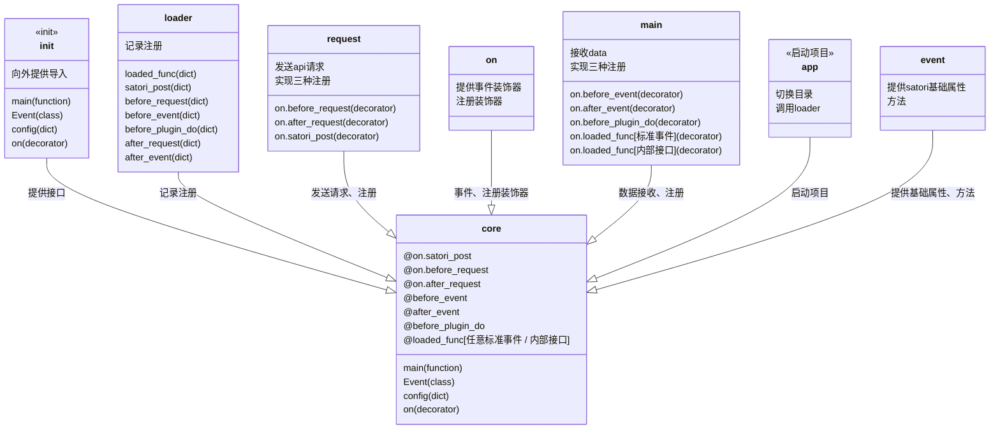

<h1 align="center"> TomorinBOT  </h1>

  

v0.2.0

  人間になりたいうた...

<h1 align="center">
  <a href="https://github.com/kumoSleeping/TomorinBot/wiki"> Click Here.> Core WIKI</a>
</h1>

***
## イントロダクション

Tomorin项目模版是由Python编写的，代码简约、轻小、无异步、线程化、插件化，基于**Satori协议**的的聊天机器人后端**模版框**。   

整体设计灵感来自Koishi，命名来自[MyGO!!!!!](https://zh.moegirl.org.cn/MyGO!!!!!)。

## フロントエンドサポート

| 前端                  | 可用性 |
|:----------------------|:-------:|
| [koishi-plugin-server]()  | ✅     |
| [go-qq2str]()              | 🔧     |
| [satori.js]()              | 🫓     |
| chronocat             | ✅🏃     |

可以用支持Satori协议的服务连接本项目。

### 核心

## 关于此模版
本模版出发点是学习优秀设计方法，简洁易用，让简单的功能实现可以高速产出。 

如果您习惯使用SDK编写项目，我十分推荐您使用[RF-Tar-Railt/satori-python](https://github.com/RF-Tar-Railt/satori-python/releases/tag/v0.4.0)进行更开发。

## 仓库
`.gitignore`规则了忽略了所有的`config.yml`。

------

