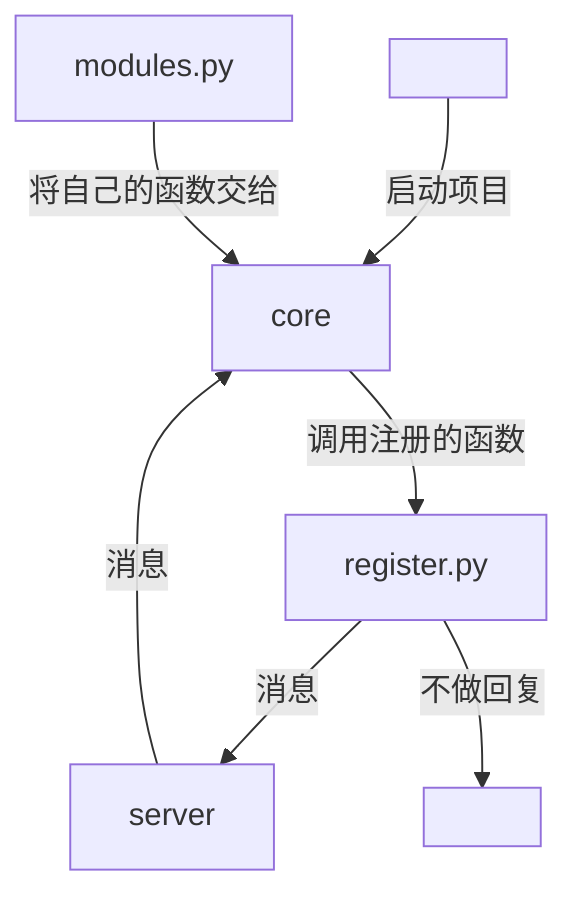

<h1 align="center"> TomorinBOT   </h1>


<p align="center">

<a href="https://github.com/kumoSleeping/TomorinBot/blob/main/core/__init__.py">
    
  </a>

<a href="https://github.com/kumoSleeping/TomorinBot/blob/main/LICENSE">
    
  </a>
<a href="https://www.python.org/">
    
  </a>

  <a href="https://satori.js.org/zh-CN/">
    
  </a>

</p>
<p align="center">
<br>  かつて忘れられない、星空は未来を照らし、次の春へ。
<br>
――「2024.1.30 10:54:23・東京・豊島区」
<br> 

***
## 介绍


Tomorin是由Python编写的，结构简单、客户端低代码量、使用同步编程+线程化、使用注册+模块思想，基于**Satori协议**的**聊天机器人后端模版**。     
因此，本程序也是一个satori协议的客户端实现，用于连接satori服务器，接收和发送消息。   
用户可以在此模版上编写注册自己的函数，使得在收到各类信息时，对应函数被调用。    

## 运行

```shell
pip install PyYAML requests hupper websocket-client
```

```shell
python3 core
```


## 结构




## 关于开发

基于[Satori协议](https://satori.js.org/zh-CN/)的快速上手。

```py
# register.py
from modules import on, Event

@on.message_created
def echo_(event: Event):
    if (r := event.message.content).startswith('echo '):
        event.message_create(r[5:])
```

符合直觉的类型提示助力简单的快速开发。


## 关于
本模版出发点是学习与探索设计方法，让简单的功能实现可以高速产出。   
`.gitignore`规则了忽视了一些东西，请注意检查。


------


